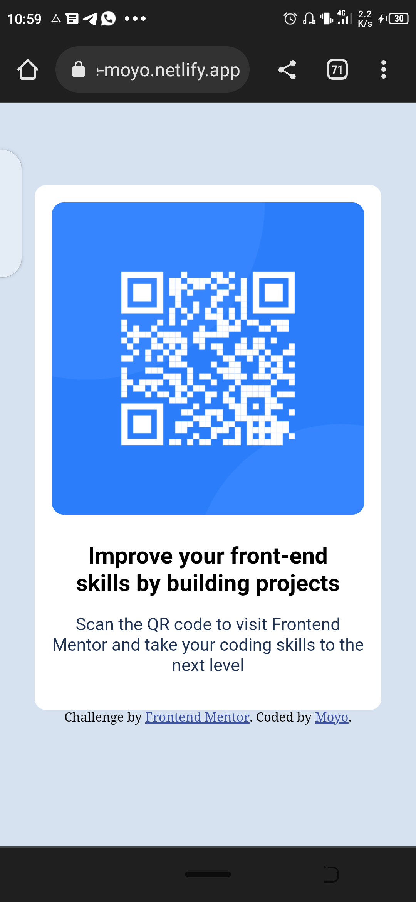

# Frontend Mentor - QR code component solution

This is a solution to the [QR code component challenge on Frontend Mentor](https://www.frontendmentor.io/challenges/qr-code-component-iux_sIO_H). Frontend Mentor challenges help you improve your coding skills by building realistic projects. 

## Table of contents

- [Overview](#overview)
  - [Screenshot](#screenshot)
  - [Links](#links)
- [My process](#my-process)
  - [Built with](#built-with)
  - [What I learned](#what-i-learned)
  - [Continued development](#continued-development)
- [Author](#author)

## Overview

### Screenshot

Mobile View

### Links

- Solution URL: [Add solution URL here](https://your-solution-url.com)
- Live Site URL: [Add live site URL here](https://your-live-site-url.com)

## My process
Using a main div container with **id-#main**, it contained the QR code image. Then i created another another div with **id-#text** where i placed the necessary texts as different blick elements.

### Built with

- HTML5
- CSS
- Mobile-first workflow

### What I learned

i learned a bit more of how to implement media queries.

### Continued development
Continued development in scaling elements both in desktop and mobile. This design is not looking so well on desktop view as i intended.

## Author

- Website - [Moyo Sharon](https://github.com/MoyoSharon)
- Frontend Mentor - [@MoyoSharon](https://www.frontendmentor.io/profile/MoyoSharon)
- Twitter - [@Moyo_61](https://www.twitter.com/moyo_61)

